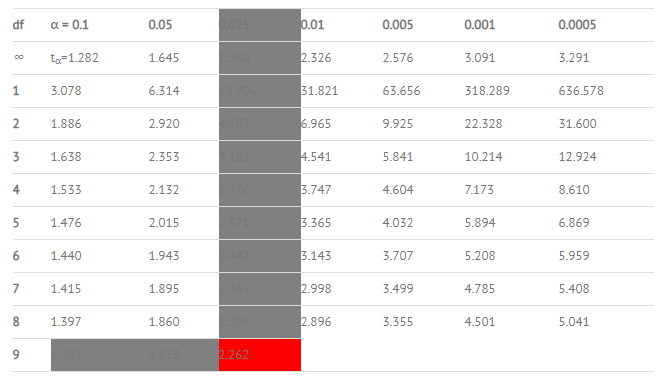

#***Confidence Interval***

A Confidence Interval is a range of values we are fairly sure our true value lies in.

The confidence interval tells you how confident you are in your results. With any survey or experiment, you’re never 100% sure that your results could be repeated. If you’re 95% sure, or 98% sure, that’s usually considered good in statistics. That percentage of sureness is the confidence interval.

***Example***

>Question:
>
>A group of 10 foot surgery patients had a mean weight of 240 pounds. The sample standard deviation was 25 pounds. Find a confidence interval for a sample for the true mean weight of all foot surgery patients. Find a 95% CI.

***Step 1***: Subtract 1 from your sample size. 10 – 1 = 9. This gives you degrees of freedom, which you’ll need in step 3.

***Step 2***: Subtract the confidence level from 1, then divide by two.

(1 – .95) / 2 = .025

***Step 3***: Look up your answers to step 1 and 2 in the t-distribution table. For 9 degrees of freedom (df) and alpha is equal to 0.025, my result is 2.262.

***Step 4***: Divide your sample standard deviation by the square root of your sample size.

**25 / sqrt(10) = 7.90569415**

***Step 5***: Multiply step 3 by step 4.

**2.262 × 7.90569415 = 17.8826802**

***Step 6***: For the lower end of the range, subtract step 5 from the sample mean.

**240 – 17.8826802 = 222.117**

***Step 7***: For the upper end of the range, add step 5 to the sample mean.

**240 + 17.8826802 = 257.883**

***That’s how to find the confidence interval for a sample!***
