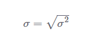
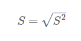
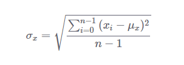
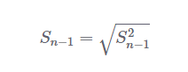

#***STANDARD DEVIATION***

The standard deviation measures the amount of variation or dispersion of a set of numeric values. Standard deviation is the square root of variance. So, if we want to calculate the standard deviation, then all we just have to do is to take the square root of the variance as follows:

Again, we need to distinguish between the population standard deviation, which is the square root of the population variance and the sample standard deviation, which is the square root of the sample variance (S^2). We'll denote the sample standard deviation as S:

Low values of standard deviation tell us that individual values are closer to the mean. High values, on the other hand, tell us that individual observations are far away from the mean of the data.

Values that are within one standard deviation of the mean can be thought of as fairly typical, whereas values that are three or more standard deviations away from the mean can be considered much more atypical. They're also known as outliers.

Unlike variance, the standard deviation will be expressed in the same units of the original observations. Therefore, the standard deviation is a more meaningful and easier to understand statistic. Retaking our example, if the observations are expressed in pounds, then the standard deviation will be expressed in pounds as well.

If we're trying to estimate the standard deviation of the population using a sample of data, then we'll be better served using n - 1 degrees of freedom. Here's a math expression that we typically use to estimate the population variance:

Note that this is the square root of the sample variance with n - 1 degrees of freedom. This is equivalent to say:

Let us say we have a dataset [3, 5, 2, 7, 1, 3]. To find its variance, we need to calculate the mean which is:

>(3+5+2+7+1+3)/6 = 3.5

Then, we need to calculate the sum of the square deviation from the mean of all the observations.

>(3-3.5)^2+(5-3.5)^2+(2-3.5)^2+(7-3.5)^2+(1-3.5)^2+(3-3.5)^2=23.5

To find the variance, we just need to divide this result by the number of observations like this:

>23.5/6 = 3.916666667

Since, Standard Deviation is the square root of Variance, the value of SD is:

>Standard Deviation is 1.979057014...5