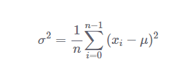

#***VARIANCE***

In statistics, the variance is a measure of how far individual (numeric) values in a dataset are from the mean or average value. The variance is often used to quantify spread or dispersion. Spread is a characteristic of a sample or population that describes how much variability there is in it.

A high variance tells us that the values in our dataset are far from their mean. So, our data will have high levels of variability. On the other hand, a low variance tells us that the values are quite close to the mean. In this case, the data will have low levels of variability.

To calculate the variance in a dataset, we first need to find the difference between each individual value and the mean. The variance is the average of the squares of those differences. We can express the variance with the following math expression:

Let us say we have a dataset [3, 5, 2, 7, 1, 3]. To find its variance, we need to calculate the mean which is:

>(3+5+2+7+1+3)/6 = 3.5

Then, we need to calculate the sum of the square deviation from the mean of all the observations.

>(3-3.5)^2+(5-3.5)^2+(2-3.5)^2+(7-3.5)^2+(1-3.5)^2+(3-3.5)^2=23.5

To find the variance, we just need to divide this result by the number of observations like this:

>23.5/6 = 3.916666667

The variance of our data is 3.916666667. The variance is difficult to understand and interpret, particularly how strange its units are.