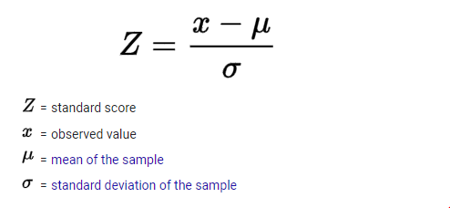

#***Z Score***

A z-score is the number of standard deviations away from a mean for a data point. A z-score helps point out how unusual or usual a data point is from the other values. A z-score must be used with a normal distribution curve.

For example, let’s say you have a test score of 190. The test has a mean of 150 and a standard deviation of 25. Assuming a normal distribution, your z score would be:

>(190 - 150) / 25 = 1.6

The Z Score is **1.6**